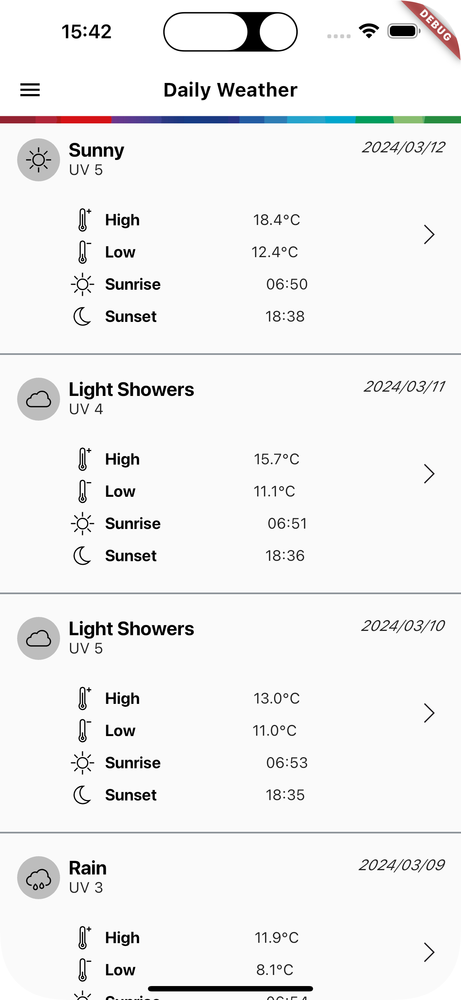

# Bosch weather App Challenge

## Description

This is a very simple weather app, that shows a few meteorological data about the past 7 and the
next 3 days.

### Libraries used in this project:

- [Http](https://pub.dev/packages/http)
- [Hooks Riverpod](https://pub.dev/packages/hooks_riverpod)
- [Riverpod Annotation](https://pub.dev/packages/riverpod_annotation)
- [Freezed Annotation](https://pub.dev/packages/freezed_annotation)
- [Freezed](https://pub.dev/packages/freezed)
- [Flutter SVG](https://pub.dev/packages/flutter_svg)
- [Collection](https://pub.dev/packages/collection)
- [Mokito](https://pub.dev/packages/mockito)

For more about Flutter , visit [flutter.dev](https://flutter.dev).

## Home Page
